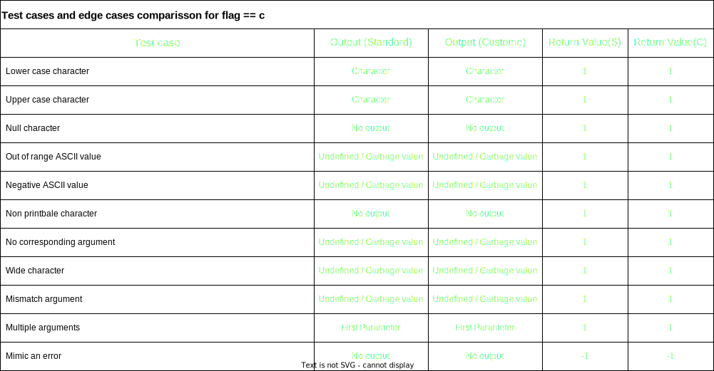

# ft_printf
Replicating the behavior of standrad prinf function in C and create custome ft_printf

`int	ft_printf(const char *format, ...)` fucntion is the main function which is itterating through each and every character in the string passed by `*format`.

`static int	ft_formatconversion(char flag, va_list args)` is a support funtion inside ft_printf.c file which will call the respective function base on the value of the `falg`.

