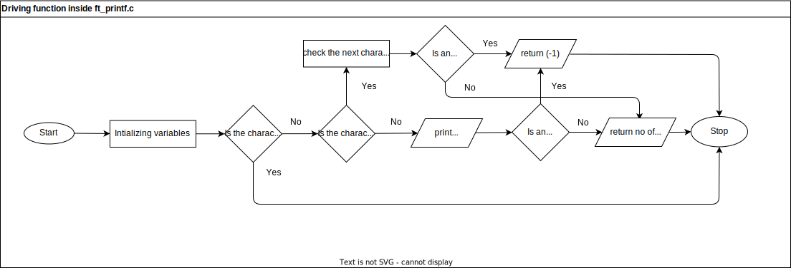

# ft_printf

**Objective:** Develop a custom implementation of the standard `printf` function in C, replicating its behavior with out using standard functions available.

## Main Function: `ft_printf`

The `ft_printf` function is the entry point, responsible for processing the format string and managing formatted output.

```c
int ft_printf(const char *format, ...)
```


### Support function: `ft_formatconversion`

The `ft_formatconversion` function is a static helper function within the `ft_printf.c` file. Handles specific format specifiers (`flag`) and delegates to the appropriate handler functions based on the value of the `flag` parameter.

```c
static int	ft_formatconversion(char flag, va_list args)
```


### `flag == c` || `%c`

This flag will invoke the the function `ft_printchar` defined in file `ft_helper.c`. This function will print a single charater passed as parametre `int c` with the standard function `write`. Return value is alwasy (1) for success and will return (-1) where write is fail to print the `int c`

```c
int	ft_printchar(int c)
```

